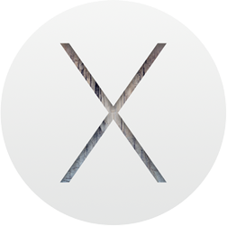

# Mac Build (using Ansible)

[](https://github.com/fgimian/campies/blob/master/LICENSE)



Artwork courtesy of [Apple](http://www.apple.com/)

## Introduction

The goal of this project is fully automate macOS workstation using Ansible.
I have currently implemented the following:

* **macOS & Software Defaults**: Updating of plist properties for various
  aspects of macOS and software configuration.  This uses a custom plist module
  which allows for complex updates of plist files far beyond the defaults
  command.  The plist module is a modified version of
  [Matthias Neugebauer's plist module](https://github.com/mtneug/ansible-modules-plist).
* **Unix Package Installation**: This is being accomplish with the use of
  [homebrew](https://github.com/Homebrew/homebrew).
* **Development Setup**: Installation and configuration of technologies
  such as Python, Node.js and Docker.
* **Desktop Application Installation**: This is being performed with the use
  of [homebrew-cask](https://github.com/caskroom/homebrew-cask).
* **Appstore Application Check**: Perform a check to see if the app is
  installed, and notify the user that they must install it from the App Store if it isn't.
* **Configuration Files & Symlinks**: Any files and folders that are to be 
  copied or symlinked, including app settings, licenses and dotfiles.
* **Dock Configuration**: Automatic building of the Dock using
  [dockutil](https://github.com/kcrawford/dockutil).
* **Default Apps**: File associations for various applications using
  [duti](https://github.com/moretension/duti).
* **Startup Setup**: Ensures that the required items start on startup using
  [loginitems](https://github.com/OJFord/loginitems).
* **Terminal Customisation**: Setting up the Terminal using JXA.

## Quick Start

Before you get started, you may wish to perform the following steps to save
time and ensure everything works as expected:

1. Copy a Homebrew cache backup to `~/Library/Caches/Homebrew`
2. Copy App Store apps that you have previously downloaded to `/Applications`
3. Copy `System Automation` containing various settings and licenses to `~/Documents`
4. Install Apple's Command Line Tools manually to avoid them being re-downloaded

Now, run the following in your Terminal to use my configuration:

```bash
git clone https://github.com/fgimian/macbuild.git
cd macbuild
./macbuild.sh
```

It is strongly suggested that you reboot your Mac after the first run
of this tool.

If you wish to install the various sample libraries and sound packs, connect
one of your backup drives and run the following:

```bash
./extras/samples.py
```

## Manual Tasks

The following tasks must be performed manually as I have yet to find a way to
automate them.

### Installation & Configuration (macOS)

* **Finder**: Setup sidebar containing favourites
* **Services**: In System Preferences / Keyboard / Services, enable 'New Terminal at Folder' and 'New Terminal Tab at Folder'.
* **Notification Centre**: Set the order of items and allow permission
* **Safari**: Install extensions (1Password and Adblock Plus)
* **App Store Login Items**: Start App Store menubar apps and set them to start
  at login (AppCleaner and OneDrive).

### Installation & Configuration (General)

* **Audio Hijack**: Start the app multiple times to dismiss welcome and mailing
  list alerts.  You must also install Instant On to ensure the app works.
* **Clear**: Enable iCloud
* **Focus**: Start Focus manually as it won't initialise successfully with
  launchd starting it for the first time.
* **Dropbox**: Disable camera uploads
* **Forklift**: Sidebar containing favourites and view settings
* **World Clock**: Country selection settings

### Installation & Configuration (Music Production)

* **Ableton Live Suite**: Preferences including skin selection
* **Ableton Sample Packs**: Installation of Ableton Live sounds
* **Apple Logic Pro X**: Preferences and key bindings
* **Steinberg Cubase Pro**: Preferences and key bindings
* **Default Plug-in Presets**: Setup default presets for your most used VST
  effects and instruments

### Manual Licensing

* **Microsoft Office**
* **Celemony Melodyne Editor**: Also requires de-activation before re-install
* **Cytomic The Drop & The Glue**
* **LennarDigital Sylenth1**: Also requires de-activation before re-install
* **Native Instruments Komplete**
* **Novation Bass Station**
* **Spectrasonics Omnisphere**

## References

### Projects

* [mac-dev-playbook](https://github.com/geerlingguy/mac-dev-playbook)
* [ansible-modules-plist](https://github.com/mtneug/ansible-modules-plist)
* [legacy-common](https://github.com/osxc/legacy-common)
* [custom-ansible-osx](https://github.com/mtneug/custom-ansible-osx)

### Frameworks

* [superlumic](https://github.com/superlumic/superlumic)
* [battleschool](https://github.com/spencergibb/battleschool)
* [osxc](http://osxc.github.io/)

### Blog Posts

* [Automating your development environment with Ansible](http://www.nickhammond.com/automating-development-environment-ansible/)
* [How to automate your Mac OS X setup with Ansible](https://blog.vandenbrand.org/2016/01/04/how-to-automate-your-mac-os-x-setup-with-ansible/)
* [Using Ansible to automate OSX installs via Superlumic](http://vanderveer.be/2015/09/27/using-ansible-to-automate-osx-installs-via-superlumic.html)
* [How to Bootstrap a new OS X Environment with Ansible](http://flounderedge.com/bootstrap-new-os-x-environment-ansible/)
* [Automation of Installation on Mac w/ Ansible](https://medium.com/@hackyGQ/automation-of-installation-on-mac-w-ansible-21354cce0d7b#.j7rujxwgc)

## License

Mac Build is released under the **MIT** license. Please see the
[LICENSE](https://github.com/fgimian/macbuild/blob/master/LICENSE) file for
more details.  Feel free take what you like and use it in your own Ansible
scripts.
